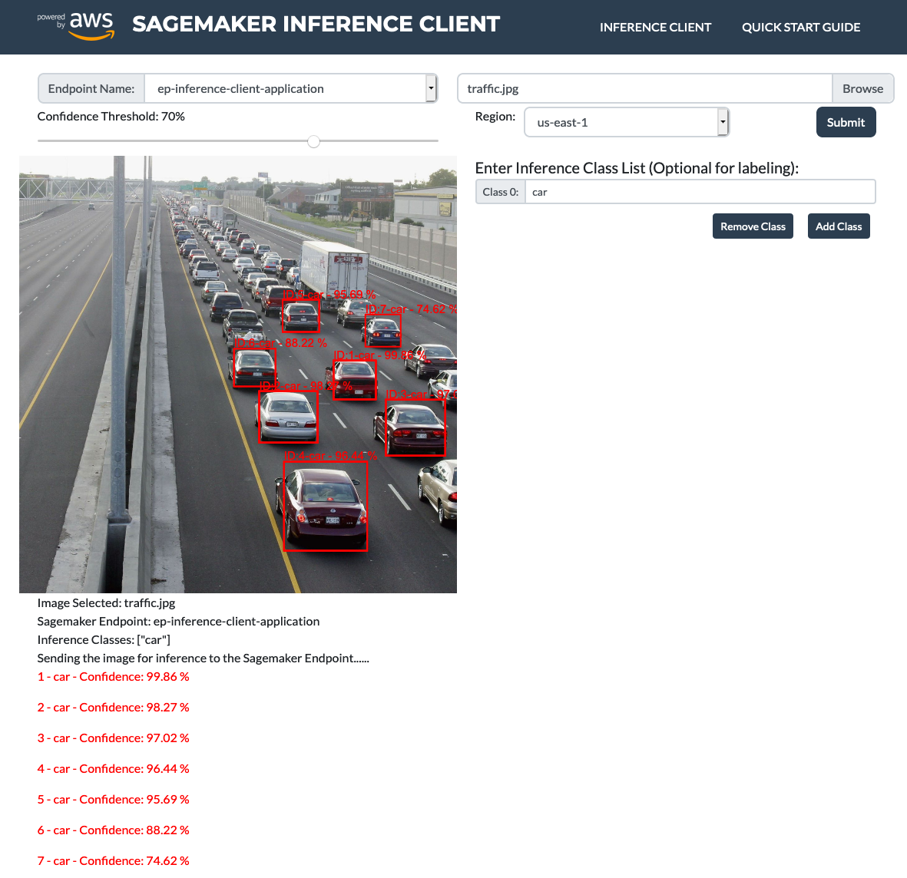
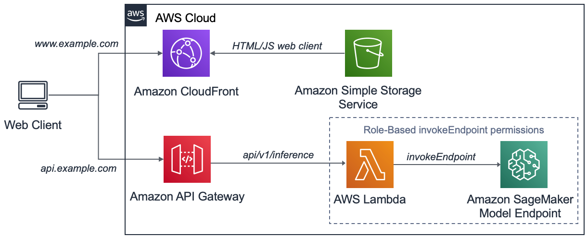

# Amazon Sagemaker Inference Client Application.

A hosted instance of this application stack can be seen at: [aws-inference-client](https://dbxdefot548c.cloudfront.net/)



Amazon SageMaker is a fully managed service that removes the heavy lifting from each step of the machine learning process to make it easier to develop and train high quality machine learning models. This is especially attractive to developers that want to incorporate machine learning outcomes onto their applications without having to build and managed every step of the process.

Once trained, the machine learning model needs to be hosted and exposed in a way that makes it accessible to client applications. A common way to do this is via an Amazon Sagemaker Endpoint which is a service optimised to hosts machine learning models and presents an authenticated public interface that can be consumed by end user applications.

The application code presented in this repository consists of a native JavaScript (Bootstrap4) web client and a NodeJS AWS Lambda and Amazon API Gateway configuration. This provides an end to end example of how to perform an object detection inference against an Amazon Sagemaker Endpoint. The web client in this example overlays visual bounding boxes and text output of a user provided image submitted against the Amazon Sagemaker Endpoint as displayed above.

You are free to deploy in any AWS region supporting all of the listed services but when first creating the hosting resources it can take a few of hours for DNS to propagate and your application to become available if not deployed in **US-EAST-1**. For this reason, we will deploy in **US-EAST-1** and encourage you to do the same.

## AWS Amplify.
In addition to the application stack, AWS Amplify is used to manage a highly opinionated, secure, scalable and cost optimised deployment of the AWS services described. In doing so, further removing the heavy lifting of managing cloud or physical infrastructure from the developer to host the application. Through this process and with just a few commands, we can deploy the full application stack ready to incorporate object detection inference from our web client. See [AWS Amplify](https://docs.amplify.aws/) for more detail.  

## Application Architecture.
The application architecture is shown in the following diagram:


While provided as a code example, this application has also proven to be a useful tool to quickly visualize and validate when developing and optimising Amazon Sagemaker object detection models. Being able to see the result of your object detection model in a simulation of a real client application encourages the developer to press on with the work of experimenting with machine learning model development.

## AWS Lambda role-based permissions.
Amazon Sagemaker Endpoints present an authenticated interface to the Internet so it’s reasonable to ask why we need to route the inference request via the Amazon API Gateway and the AWS Lambda. The reason in this example is so we can use AWS IAM role-based permissions to allow the Lambda to invoke the Sagemaker Endpoint without the need for the end-user to authenticate themselves in the web client. In this case, an unauthenticated request is received by the Lambda which by virtue of the sagemaker:invokeEndpoint role-based permission is able to forward the request to the Sagemaker Endpoint. This architecture should be considered in secure environments. 

## AWS Command Line Interface (CLI)
The remaining sections will deploy the resources and architecture to host an Amazon Sagemaker Endpoint and the Inference Client Application using the AWS CLI. If not already configured, you will need to create the AWS CLI credentials and configuration file to allow CLI and programmatic access. Follow the procedure [here](https://docs.aws.amazon.com/cli/latest/userguide/cli-chap-configure.html) if required. Be sure to specify the region you intend to use during the process.

## Hosting an Object Detection Model Endpoint

Before we can deploy the inference client application, we need an object detection model hosted on an Amazon Sagemaker Endpoint to make API calls against to perform the inference. This is a two-part process of first defining the model object in Amazon Sagemaker and then hosting it on an Amazon Sagemaker Endpoint.

For this example we will use the model available at: [aws-vehicle-rear-detect-2020-05-09-model.tar.gz](https://static.dcolcott.com/sagemaker-vehicle-object-detect-lab/aws-vehicle-rear-detect-2020-05-09-model.tar.gz)

This is a custom MXnet model built for this purpose that has been trained on a relatively small training set of 210 images to detect the rear view of various cars / vehicles. If you have your own supported object detection model you are welcome to use that instead.

### Deploying the Amazon Sagemaker Model

In Amazon Sagemaker a Model object consists of the ML model itself and a container with the logic required to perform the inference. You are welcome to use your own custom containers but for convenience AWS also provide these for each of the supported ML frameworks. 

#### Save ML object detection model to S3  
Download the object-detection ML model provided above (or have your own available) and upload to S3 in the AWS region you intended to deploy the inference client application.

Follow this guide on how to [Create and Amazon S3 bucket](https://docs.aws.amazon.com/AmazonS3/latest/user-guide/create-configure-bucket.html) if you don't already have one in the specific AWS region.

#### Identify the Inference Container  
AWS provide an Inference Image Registry Path for each supported region. You can find the registry path for your chosen region the *Algorithms: BlazingText, Image Classification, Object Detection* table shown at [AWS Inference Image Registry Path](https://docs.aws.amazon.com/sagemaker/latest/dg/sagemaker-algo-docker-registry-paths.html)

In this example we will be deploying to **US-EAST-1** so will be using the registry path:  
**811284229777.dkr.ecr.us-east-1.amazonaws.com**  

Find the corresponding registry path for your region in the Inference Image Registry Path table referenced above.

Finally, we request the specific container that performs inference on object-detection models by adding the container name (object-detection) and a tag to specify we want to use the latest released as below:  
**811284229777.dkr.ecr.us-east-1.amazonaws.com/object-detection:latest**  

If deploying in ap-southeast-2 then you will need to update the Image Registry Path as the below example:  
**544295431143.dkr.ecr.ap-southeast-2.amazonaws.com/object-detection:latest**   

And as a final example if doing the same in eu-central-1 the container would be:
**813361260812.dkr.ecr.eu-central-1.amazonaws.com/object-detection:latest**  

#### Create the Amazon Sagemaker model object

Its assumed at this point you have the reference to the inference container in your region. You will also need the ARN of an Amazon Sagemaker Execution Role that has the AmazonSageMakerFullAccess IAM policy attached and finally the path to the object detection model in S3. 

With all of these you can create the Amazon Sagemaker Model object with the below commands:

```
# Enter name that will be given to the Amazon Sagemaker Model Object
MODEL_NAME=aws-vehicle-rear-detect-2020-05-09

# Enter the model inference container reference
MODEL_CONTAINER=811284229777.dkr.ecr.us-east-1.amazonaws.com/object-detection:latest

# Enter the supported Object Detection ML Model S3 URL
MODEL_S3_URI=s3://my-s3-bucket/aws-vehicle-rear-detect-2020-05-09-model.tar.gz

# Enter ARN for Amazon Sagemaker Execution Role with AmazonSageMakerFullAccess IAM policy attached 
SM_EXE_ROLE_ARN=arn:aws:iam::123456789012:role/service-role/AmazonSageMaker-ExecutionRole

# Create the Amazon Sagemaker Model
aws sagemaker create-model \
--model-name $MODEL_NAME \
--primary-container "Image=$MODEL_CONTAINER, ModelDataUrl=$MODEL_S3_URI" \
--execution-role-arn $SM_EXE_ROLE_ARN
```

You can now go to the Amazon Sagemaker console and see the Amazon Sagemaker Model has been created.

### Deploy an Amazon Sagemaker Endpoint  
To create the Amazon Sagemaker Endpoint, you first need to create the Endpoint configuration.

#### Create the Amazon Sagemaker Endpoint Config  
 Execute the below to create the Amazon Sagemaker Endpoint Config. Verify in the Amazon Sagemaker console that the configuration was successfully deployed.

```
# Enter the Sagemaker Endpoint Config Name to use
EPC_NAME=epc-inference-client-application

# Create the Amazon Sagemaker Endpoint configuration object.
# Note:  Adjust the Model Name, Instance Count and Instance type as needed. 
aws sagemaker create-endpoint-config \
--endpoint-config-name $EPC_NAME \
--production-variants '[{"VariantName":"variant-1", "ModelName":"aws-vehicle-rear-detect-2020-05-09", "InitialInstanceCount": 1, "InstanceType":"ml.m4.xlarge"}]'
```

#### Deploy the Amazon Sagemaker Endpoint
And now finally deploy the Amazon Sagemaker Endpoint with the below commands:

```
# Enter the Sagemaker Endpoint Name to use
EP_NAME=ep-inference-client-application

# Enter the Sagemaker Endpoint Config Name that will be applied (assumes is as created above)
EPC_NAME=epc-inference-client-application

aws sagemaker create-endpoint \
--endpoint-name $EP_NAME \
--endpoint-config-name $EPC_NAME
```

The Amazon Sagemaker Endpoint will now be deployed, this can take a number of minutes to complete. Look in the Amazon Sagemaker console and verify the Endpoint is being initialized. 

## Deploying the Inference Client Application.
Deploying the application stack described using AWS Amplify is just a few simple commands but does assume you have access to an AWS environment. 

The following procedure assumes you are on a supported Linux or MacOS device and have installed:
1. Node: v10.16.x or greater
1. NPM: v6.13.x or greater
1. Git: v2.23.0 or greater

#### To deploy the application stack, follow the below steps.

**1. Clone the Amazon Sagemaker Inference Client Application GIT repository and 'cd' into the directory:**  
```
git clone https://github.com/aws-samples/amazon-sagemaker-inference-client.git
cd amazon-sagemaker-inference-client
```

**2. Install the application dependencies and build the project:**  
```
npm install
npm run build
```

**3. Install AWS Amplify CLI:**   
```
npm install -g @aws-amplify/cli@4.18.1
```

**4. Initialize AWS Amplify in this project:**  
```
amplify init
```

Enter the following responses:  
* Enter a name for the project **awsamplifysagemaker**
* Enter a name for the environment: **master**
* Choose your default editor: ***[Select your preferred IDE, select none if not listed.]***
* Choose the type of app that you're building: **javascript**
* Please tell us about your project
  * What javascript framework are you using: **none**
  * Source Directory Path: **src**
  * Distribution Directory Path: **dist**  
  * Build Command:  **npm run-script build**
  * Start Command: **npm run-script start**
Using default provider  awscloudformation

For more information on AWS Profiles, see:
https://docs.aws.amazon.com/cli/latest/userguide/cli-multiple-profiles.html

* Do you want to use an AWS profile? **Yes**
* Please choose the profile you want to use: ***[Choose the profile you want for the desired AWS Account]***

**5. Using AWS Amplify, add S3 backed CloudFront public hosting:**  
```
amplify add hosting
```

Enter the following responses: 
* Select the plugin module to execute **Amazon CloudFront and S3**
* Select the environment setup: **PROD (S3 with CloudFront using HTTPS)**
* hosting bucket name: ***[Enter to accept the default or enter a unique value.]***

**6. Using AWS Amplify, create the backend API Gateway and serverless function:**  
```
amplify add api
```
Enter the following responses:  
**Note:** *Some of the text responses given below are referenced in the source code and so must be copied exactly.*

* Please select from one of the below mentioned services: **REST**
* Provide a friendly name for your resource to be used as a label for this category in the project: **smInferenceClient**
* Provide a path (e.g., /items) **/api/v1/sagemaker**
* Choose a Lambda source: **Create a new Lambda function**
* Provide a friendly name for your resource to be used as a label for this category in the project: **awsamplifysagemaker**
* Provide the AWS Lambda function name: **awsamplifysagemaker**
* Choose the function runtime that you want to use: **NodeJS**
* Choose the function template that you want to use: **Serverless ExpressJS function (Integration with API Gateway)**
* Do you want to access other resources created in this project from your Lambda function? **No**  
* Do you want to invoke this function on a recurring schedule" **No**
* Do you want to edit the local lambda function now? **No**  
Successfully added the Lambda function locally  
* Restrict API access: **No**
* Do you want to add another path? **No**

Successfully added resource smInferenceClient locally.

**7. Copy the AWS Lambda code to local AWS Amplify backend function:**  
In the previous step, AWS Amplify defined a skeleton Lambda function with placeholders for the function handler. The below command overwrites this with the Sagemaker Inference client backend source code developed for this project: 
```
cp -rf lambda-function/src/ amplify/backend/function/awsamplifysagemaker/src/
```

**8. Update AWS Amplify generated Lambda role-based policy to add InvokeEndpoint:**  
In the previous step, AWS Amplify created an AWS CloudFormation template to deploy the AWS Lambda function including the role-based permissions. The below command overwrites this template to also include an additional policy to give the Lambda sagemaker:InvokeEndpoint permissions. 
```
cp lambda-function/src/awsamplifysagemaker-cloudformation-template.json amplify/backend/function/awsamplifysagemaker/awsamplifysagemaker-cloudformation-template.json
```

**9. Push the application stack and publish the client-side code:**  

The above commands configured the automation scripts to deploy an optimised hosting stack but AWS Amplify only saved these locally in the **amplify** directory that was created with the ```amplify init``` command.

This concept of local and remote configuration is key to AWS Amplify. You can see the current status of the configured service as below:
```
amplify status
```

AWS Amplify has two commands to push the local config:
1. **amplify push:** Will push the automation scripts for any services that are not in sync.
2. **amplify publish:** Will perform an **amplify push** then also upload the content of the **dist** folder.

In this case because we want to create the environment and also upload the client application so we will choose to publish:
```
amplify publish
```

Confirm the update when asked:  
? Are you sure you want to continue? (Y/n): **Y**

At the completion of this command you will be given the URL the application is hosted at such as:
```
Your app is published successfully.
https://aaaabbbbcccc.cloudfront.net
```

Record this URL.

**Note:** This command can take some time. It will create an S3 bucket with a secure CloudFront distribution to publicly host the client side application. For the backend, AWS Amplify will create and deploy the Lambda and create an Amazon API gateway and configure the required integrations between the them. 

## Updating the hosting environment or application code
If in the future you choose to update the hosting environment with any of the many additional features of AWS Amplify such as Analytics, Notifications, PubSubs or Storage all you need to do is then apply the ```amplify push`` command. This will update the hosted services without updating the application front end content.

If you update the application front end code and want to synchronized that and the hosted environment apply the ```amplify publish``` command. 

A quick tip, if as in this case you are hosting the content via an Amazon CloudFront distribution then include the ‘-c’ switch to force an invalidation of the CDN cache to ensure your new content is presented to the Internet such as: ```amplify publish -c```

## Accessing the Web Application.
On completion of the above sections, the web client will be hosted at an Amazon CloudFront URL that was shown in the previous output. If you missed it just enter `amplify status` and look for the CloudFront distribution URL again.

**Open the Amazon CloudFront URL in a browser and enter into the UI:**  
1. **Region:** The AWS region the Endpoint is hosted,
1. **Endpoint name:** The Amazon SageMaker Endpoint to send the image for inference. 
  * This list will be auto populated from the active Sagemaker Endpoints in the selected region. 
1. **Inference Labels:** Add the inference labels / classes that the model was trained on, these are just for display. 
  * In the example model add four classes: **car, van, ute, truck**  
1. Select an image to send for inference by clicking the **Browse** button and
1. Click **Submit** to send the image for inference against the Amazon Sagemaker Endpoint

We selected an image consisting of a busy traffic scene that was found on the Internet (and not in the training image dataset) and got the below result:


As you can see, the client application was able to process the Image and update the response of the Amazon SageMaker Endpoint inference. 

## Security

See [CONTRIBUTING](CONTRIBUTING.md#security-issue-notifications) for more information.

## License

This library is licensed under the MIT-0 License. See the LICENSE file.

