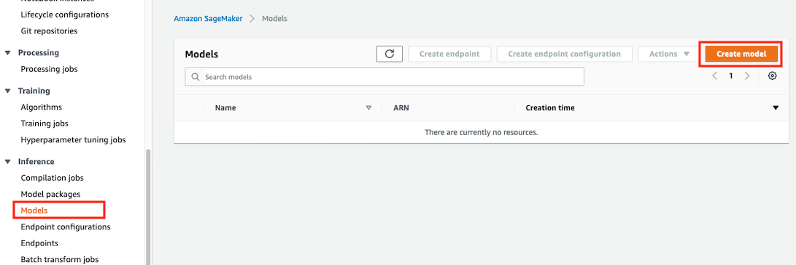
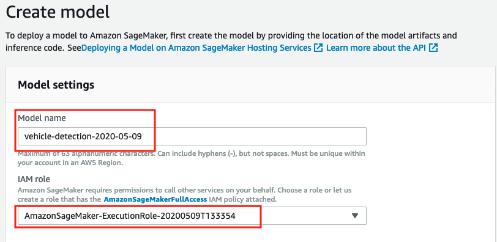
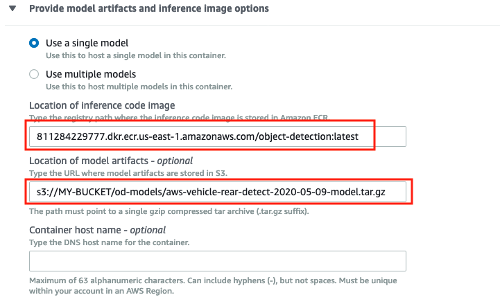
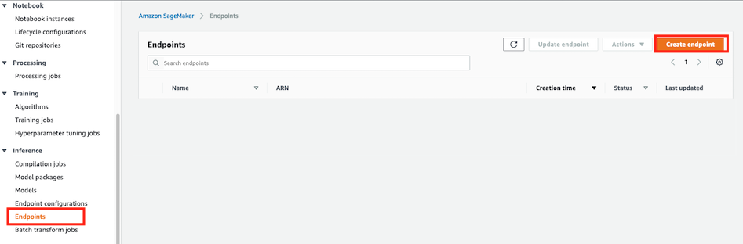
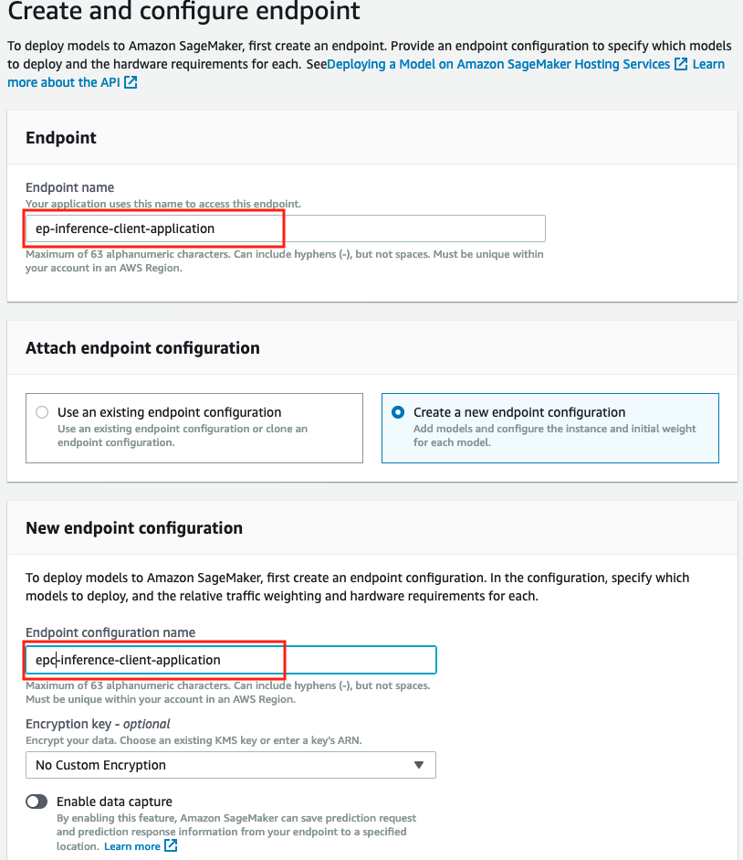
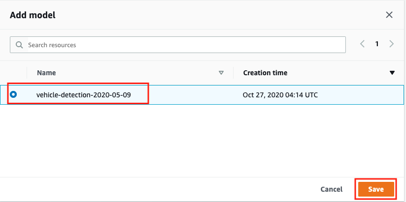

# Deploy an Amazon Sagemaker Hosted Endpoint

Before we can deploy the inference client web application, we need an object detection model hosted on an Amazon Sagemaker Endpoint to make API calls against to perform the inference. This is a two-part process of first defining the model object in Amazon Sagemaker and then hosting it on an Amazon Sagemaker Endpoint.

For this example we will use the object detection model available at: [aws-vehicle-rear-detect-2020-05-09-model.tar.gz](https://static.dcolcott.com/sagemaker-vehicle-object-detect-lab/aws-vehicle-rear-detect-2020-05-09-model.tar.gz)

This is a custom MXNet model built for this purpose that has been trained on a relatively small training set of 210 images to detect the rear section of various cars and vehicles. If you have your own supported object detection model you are welcome to use that instead.

## Deploying the Amazon Sagemaker Model

In Amazon Sagemaker, a model object consists of the ML model itself and a container image with the logic required to perform the inference. You are welcome to use your own custom containers but for convenience AWS also provide these for each of the supported ML frameworks. 

**Note:** If you have a model that was originally trained in Amazon Sagemaker, you can more easily create the Sagemaker model object by selecting **Create model** from the Amazon Sagemaker training job. In this case you can skip the below sections and go straight to deploying the Sagemaker Endpoint.

### Save ML Object Detection Model to S3  
Download the object-detection ML model provided above (or have your own available) and upload to S3 in the AWS region you intended to deploy the inference web client application.

Follow this guide on how to [Create an Amazon S3 bucket](https://docs.aws.amazon.com/AmazonS3/latest/user-guide/create-configure-bucket.html) if you don't already have one in the specific AWS region.

### Identify the Inference Container  
AWS provide a container Inference Image Registry Path for each supported region. You can find the registry image path for your chosen region from the *Algorithms: BlazingText, Image Classification, Object Detection* table shown at: [AWS Inference Image Registry Path](https://docs.aws.amazon.com/sagemaker/latest/dg/sagemaker-algo-docker-registry-paths.html)

In this example we will be deploying to **US-EAST-1** so will be using the registry path:  
**811284229777.dkr.ecr.us-east-1.amazonaws.com**  

Find the corresponding registry path for your region in the Inference Image Registry Path table referenced above.

Finally, we request the specific container that performs inference on object-detection models by adding the framework name (object-detection) and a tag to specify we want to use the latest released as below:  
**811284229777.dkr.ecr.us-east-1.amazonaws.com/object-detection:latest**  

As an example, if deploying in ap-southeast-2 then you will need to update the image registry path as the below:  
**544295431143.dkr.ecr.ap-southeast-2.amazonaws.com/object-detection:latest**   

And as a final example if doing the same in eu-central-1 the image path would be:  
**813361260812.dkr.ecr.eu-central-1.amazonaws.com/object-detection:latest**  

Use this same logic to obtain the registry image path for your region. 

### Create the Amazon Sagemaker Model Object

Its assumed at this point you have the reference to the inference image for your region and the path to the object detection model you will use in S3. With these you can now create the Amazon Sagemaker Model object. 

* In the AWS console go to **Sagemaker** and select **Models** from the **Inference** menu and click on **Create model**:

* Enter the **Model name** and select an **Amazon Sagemaker Execution Role** with the **AmazonSagemakerFullAccess** IAM policy attached. The role must also have GET access to the S3 bucket that the object detection model is located.
    * **Note:** You can create a new role from the pull down list of you don't have one previously configured.

* Enter the registry image path discussed above in the Inference code image field. As we are deploying in US-EAST-1 we will use the registry path:  
**811284229777.dkr.ecr.us-east-1.amazonaws.com/object-detection:latest**

* Enter the S3 path to the object detection model you will host in Amazon Sagemaker. In this example we are using the **aws-vehicle-rear-detect-2020-05-09-model.tar.gz** model we downloaded from the link above. 

* Leave all other settings as default and click **Create model**.

You have now imported the object detection model and wrapped it in a container that has the logic required to perform the image inference and can be hosted by an Amazon Sagemaker Endpoint. 

## Deploying the Amazon Sagemaker Endpoint
We now have the model object and can deploy it to an Amazon Sagemaker Endpoint that will expose an API the inference web application will consume.

* In the AWS console, go to **Sagemaker**, select **Endpoints** from the **Inference** menu and click **Create endpoint**.

* Enter the **Endpoint Name.** In this case we will use: **ep-inference-client-application**
    * **Tip:** Amazon Sagemaker endpoints can host multiple models and the model itself can be changed or updated so don't name the Endpoint according to the model you are deploying. Instead, name it as per the team / group that owns it or the application that will consume it. 

* For **Attach endpoint configuration** we will assume you don't have one configured and so select **Create a new endpoint configuration** and enter the **Endpoint configuration name**. In our case we will use:  **epc-inference-client-application**

* Next, in the **New endpoint configuration** click on **Add model**, select the Sagemaker model object we created previously and click **Save**

* To complete the Endpoint configuration, click **Create endpoint configuration**. 

**The Amazon Sagemaker Endpoint configured in this step will cost $0.28 to $0.35 p/h while it is active. When not in use, you should delete the Endpoint to avoid incurring additional costs. If real-time inference is not required, batch processing is a more cost effective option to consider.**

* Finally, click on **Create endpoint**. This will begin the process of initializing the Amazon Sagemaker Endpoint which can take 10 or more minutes to complete. You will see the Endpoint status move to **InService** when it is ready. 

Once you have an InService Amazon Sagemaker Endpoint you can return to the [main page](../README.md) and deploy the Inference Client Web Application.

